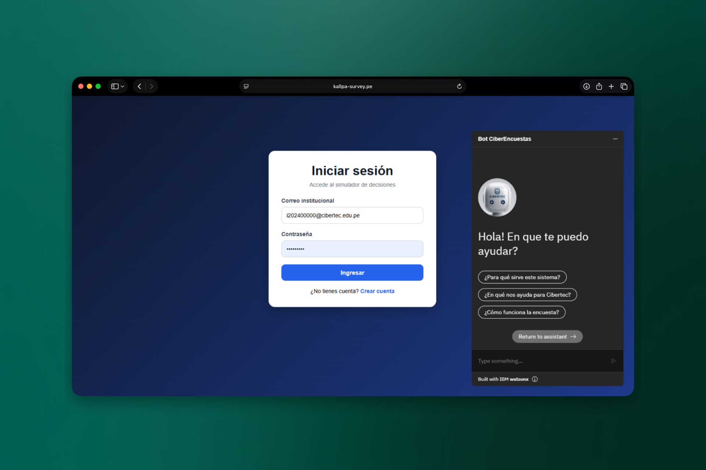

<div align="center">
  
</div>

<div align="center">


</div>

# Plataforma de Encuestas Interactivas | kallpa-survey

Plataforma web de encuestas interactivas desarrollada para Yachay-Tech. Permite crear simulaciones con preguntas encadenadas, calcular perfiles de resultado según el puntaje obtenido y mostrar recomendaciones personalizadas al usuario al finalizar.

El administrador puede gestionar múltiples encuestas, preguntas, alternativas y perfiles de resultado desde un panel dedicado.

## Stack

| Capa          | Tecnología                                        |
| ------------- | ------------------------------------------------- |
| Backend       | Spring Boot 3.4, Java 17, Spring Data JPA, BCrypt |
| Base de datos | MySQL 8                                           |
| Frontend      | Thymeleaf, HTML/CSS vanilla, Bootstrap            |
| Chatbot       | IBM Watson Assistant (web chat)                   |

## Funcionalidades

- Registro e inicio de sesión con contraseñas hasheadas (BCrypt)
- Flujo de simulación con preguntas encadenadas por alternativa
- Resultado personalizado según puntaje obtenido
- Panel de administración para gestionar simulaciones, preguntas, alternativas y perfiles de resultado
- Chatbot de asistencia integrado con IBM Watson

## Configuración

```bash
# 1. Clona el repositorio
git clone https://github.com/sunderlldev/kallpa-survey.git && cd kallpa-survey

# 2. Crea el archivo de propiedades
cp src/main/resources/application.properties.example src/main/resources/application.properties
# Edita application.properties con tus credenciales

# 3. Ejecuta el script de base de datos en MySQL
mysql -u root -p < src/main/resources/db/BD_Proyecto.sql

# 4. Corre la aplicación
./mvnw spring-boot:run
```

App disponible en `http://localhost:8080`

## Variables de configuración

| Variable | Descripción |
| -------- | ----------- |
| `spring.datasource.url` | URL de conexión MySQL |
| `spring.datasource.username` | Usuario de la BD |
| `spring.datasource.password` | Contraseña de la BD |
| `watson.integration-id` | ID de integración IBM Watson |
| `watson.region` | Región del servicio Watson |
| `watson.service-instance-id` | ID de instancia Watson |

Ejemplo mínimo en `application.properties`:

```properties
spring.datasource.url=jdbc:mysql://localhost:3306/db_yachay
spring.datasource.username=root
spring.datasource.password=tu_password

watson.integration-id=tu_integration_id
watson.region=us-east
watson.service-instance-id=tu_service_instance_id
```

## Usuarios iniciales

| Correo | Contraseña | Rol |
| ------ | ---------- | --- |
| admin@cibertec.edu.pe | admin123 | Administrador |
| estudiante@cibertec.edu.pe | usuario123 | Usuario |

## Equipo

Proyecto Integrador | Cibertec, 6to ciclo  
Grupo 09 · Juan Blas · Alzamora · Retuerto · León
